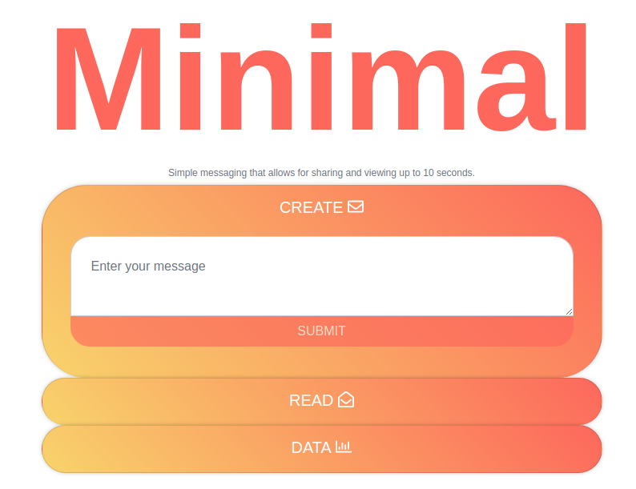

# minimal

A simple react web app for creating and reading messages.

## Overview

update 'dbRoute' in the server.js file with your MongoDB connection string [URI](https://docs.mongodb.com/v3.2/reference/connection-string/)

```
dbRoute = "mongodb://[username:password@]host1[:port1][/[database][?options]]"
```

run with command

```
npm start
```

## dependencies
* [Nodejs](https://nodejs.org/en/)
* [MongoDB](https://www.mongodb.com/)
* [Mongoose](https://mongoosejs.com/)
* [Express](https://expressjs.com/)
* [Reactjs](https://reactjs.org/)
* [FontAwesome](https://github.com/FortAwesome/react-fontawesome)
* [Highcharts](https://github.com/highcharts/highcharts-react)

This project was bootstrapped with [Create React App](https://github.com/facebook/create-react-app).

